# CDC System Architecture

## Mục tiêu tài liệu

Tài liệu này mô tả kiến trúc tổng thể của hệ thống `cdc-system`, bao gồm:
- kiến trúc production-grade ở mức toàn hệ thống
- deployment topology cho Docker/Kubernetes
- component diagram chi tiết cho `centralized-data-service`
- các luồng deep-dive cho `Reconciliation`, `DLQ`, và `Schema Evolution`

Mục tiêu của hệ thống là đồng bộ dữ liệu thay đổi từ MongoDB sang PostgreSQL theo hướng an toàn, có khả năng phục hồi, và hỗ trợ tiến hóa schema trong runtime.

---

## 1. System Overview

### 1.1 Thành phần chính

- `cdc-auth-service`: service xác thực, JWT, user management cơ bản cho CMS.
- `cdc-cms-service`: control plane để quản trị registry, mapping rules, reconciliation, schedules, alerts.
- `cdc-cms-web`: giao diện vận hành dành cho admin/operator.
- `centralized-data-service`: worker plane xử lý ingestion, transformation, schema evolution, reconciliation, DLQ, scheduling.
- `MongoDB`: nguồn dữ liệu vận hành ban đầu.
- `Debezium + Kafka`: data plane cho CDC event chính.
- `NATS / JetStream`: command bus và event bus cho control plane, retry, alerts, orchestration.
- `PostgreSQL`: target store và metadata store.
- `Redis`: cache và coordination cho worker/control plane.

### 1.2 Năng lực cốt lõi

- CDC ingestion từ MongoDB sang PostgreSQL.
- Config-driven mapping rules.
- Schema drift detection và schema evolution có kiểm soát.
- Reconciliation nhiều tier để đảm bảo data integrity.
- DLQ state machine để retry lỗi không chặn worker.
- Auditability và observability cho production.

---

## 2. Production-Grade Architecture

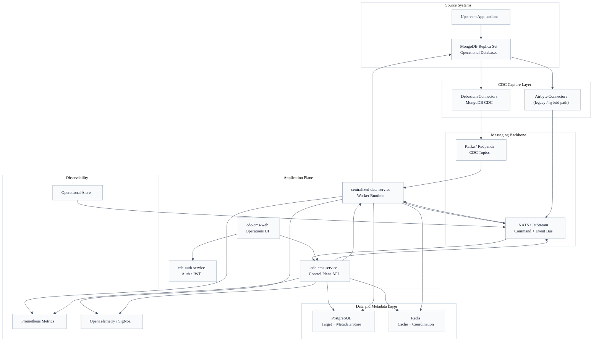

### 2.1 Kiến trúc logic

- `MongoDB` là source of truth cho dữ liệu vận hành.
- `Debezium` capture thay đổi từ MongoDB và publish vào `Kafka`.
- `centralized-data-service` consume CDC events, transform theo metadata, rồi upsert vào PostgreSQL.
- `cdc-cms-service` quản trị metadata, mapping rules, schedules, reconciliation commands, drift alerts.
- `NATS` được dùng như command bus nhẹ cho orchestration nội bộ.
- `Redis` hỗ trợ cache schema, leader-election/co-ordination, và runtime caching.

---

## 3. Deployment Diagram (Docker / Kubernetes)

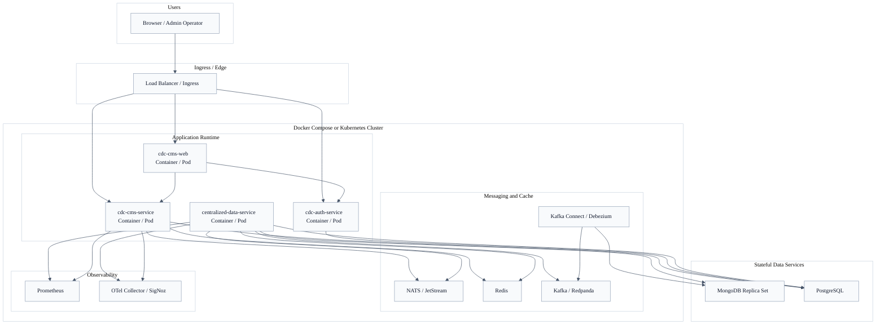

### 3.1 Gợi ý triển khai production

- `cdc-cms-web`, `cdc-cms-service`, `cdc-auth-service`, `centralized-data-service` nên là stateless workloads để scale ngang.
- `PostgreSQL`, `MongoDB`, `Kafka`, `Redis`, `NATS` là stateful services, cần chiến lược persistence/backup riêng.
- `centralized-data-service` có thể scale nhiều replicas; các job định kỳ nên dùng leader-election hoặc DB locking.
- `Debezium / Kafka Connect` nên tách riêng khỏi worker app để giảm coupling vận hành.

---

## 4. centralized-data-service Component Diagram

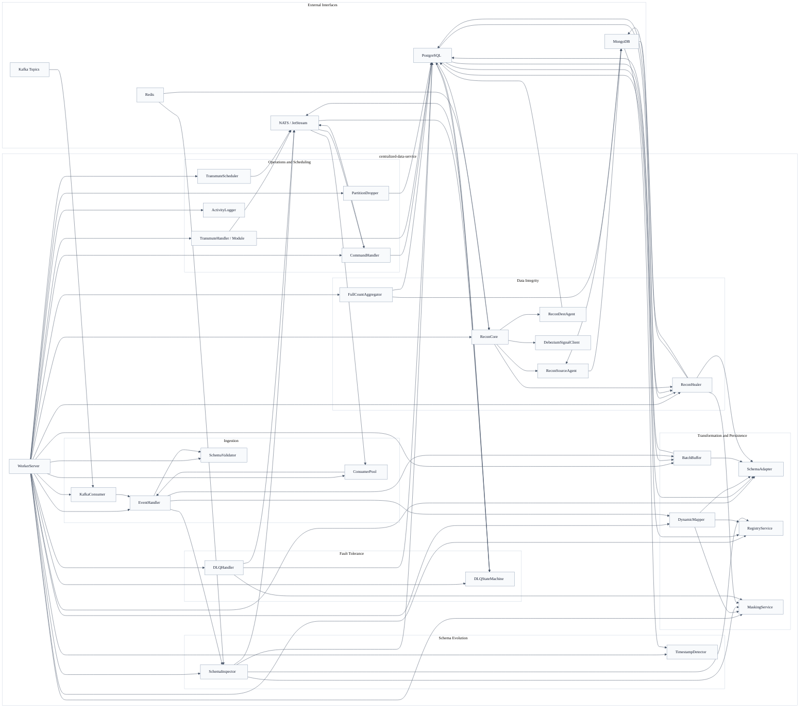

### 4.1 Trách nhiệm các domain chính trong worker

- `Ingestion`: nhận event từ Kafka/NATS, parse, validate, dispatch vào processing pipeline.
- `Transformation and Persistence`: map field, coerce type, mask dữ liệu nhạy cảm, build unified upsert SQL.
- `Schema Evolution`: phát hiện drift, lưu pending fields, bắn alert, hỗ trợ timestamp detection.
- `Data Integrity`: thực hiện reconciliation theo nhiều tier và healing có OCC.
- `Fault Tolerance`: quản lý ghi lỗi, retry scheduling, replay failed events.
- `Operations and Scheduling`: nhận command từ CMS/NATS, chạy transmute, retention, background jobs.

---

## 5. Critical Ingestion Path

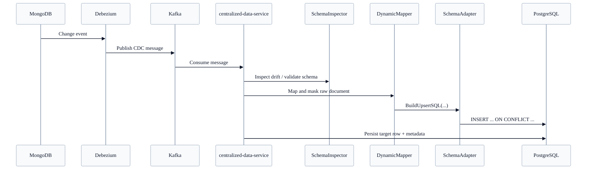

---

## 5.5 Shadow → Master Materialisation Path (since Sprint 5)

Bổ sung so với Section 5: ingestion từ Kafka không ghi thẳng vào PG business target.
Thay vào đó đi qua 2 tầng.

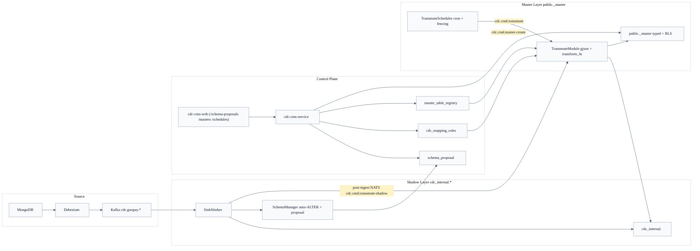

### 5.5.1 Shadow Layer (cdc_internal.<table>)
- SinkWorker consume Kafka topic `cdc.goopay.<db>.<table>`.
- Upsert raw event + system cols (`_gpay_source_id`, `_raw_data`, `_source_ts`, `_synced_at`, `_version`, `_hash`, `_gpay_deleted`, timestamps).
- SchemaManager detect field mới:
  - Nếu thuộc financial whitelist → insert `cdc_internal.schema_proposal` (admin approval).
  - Ngược lại auto-ALTER shadow với JSONB/TEXT.
- Post-ingest publish NATS `cdc.cmd.transmute-shadow` (best-effort).

### 5.5.2 Schema Proposal Workflow
- Proposal submit bởi SinkWorker (detect drift) hoặc admin thủ công.
- `/schema-proposals` UI hiển thị Badge pending count.
- Approve → CMS TX: `ALTER TABLE … ADD COLUMN` + `INSERT cdc_mapping_rules` (status='approved').
- Reject → status='rejected', field stays in _raw_data.

### 5.5.3 Mapping Rules
- Row trong `cdc_mapping_rules`: (source_table, target_column, data_type, jsonpath, transform_fn, is_active, status).
- Admin tạo qua `/registry/:id/mappings` hoặc auto từ Approve proposal.
- Preview button gọi `/api/v1/mapping-rules/preview` dùng gjson eval 3 sample rows trước khi save.

### 5.5.4 Master Registry (cdc_internal.master_table_registry)
- Row per master: (master_name, source_shadow, transform_type, spec JSONB, is_active, schema_status ∈ {pending_review, approved, rejected, failed}).
- Admin Create qua `/masters` wizard → schema_status='pending_review'.
- Approve → NATS `cdc.cmd.master-create` → Worker `MasterDDLGenerator.Apply`:
  - SELECT approved rules + build CREATE TABLE `public.<master_name>`.
  - Indexes: PK + UNIQUE(_gpay_source_id) + _created_at/_updated_at + financial auto-index.
  - `SELECT cdc_internal.enable_master_rls(<master>)` → RLS policy `rls_master_default_permissive`.
- Gate L2: `is_active` chỉ bật được khi `schema_status='approved'` (CHECK constraint).

### 5.5.5 Transmuter Module
- Subscribe NATS:
  - `cdc.cmd.transmute` (per-master batch).
  - `cdc.cmd.transmute-shadow` (per-row real-time, post-ingest hook).
- Check gate chain:
  1. master `is_active=true AND schema_status='approved'`.
  2. shadow `is_active=true AND profile_status='active'`.
  3. At least 1 approved rule in `cdc_mapping_rules`.
- Apply mapping rule per row:
  - `gjson.GetBytes(_raw_data, rule.jsonpath)` → extract.
  - `transform_fn` (nullable): `numeric_cast`, `mongo_date_ms`, `base64_decode`, etc.
  - Build typed value theo `rule.data_type`.
- Upsert `public.<master_name>` với OCC (ON CONFLICT WHERE _source_ts older) + fencing.

### 5.5.6 TransmuteScheduler
- Cron poll 60s + `FOR UPDATE SKIP LOCKED` + `app.fencing_machine_id` + `app.fencing_token`.
- 3 mode per schedule:
  - `cron`: cron_expr 5-field (robfig/cron/v3).
  - `immediate`: chỉ chạy khi admin click Run Now.
  - `post_ingest`: fire mỗi post-ingest trigger (real-time).
- UI `/schedules` hiển thị next_run_at, last_run_at, last_stats.

### 5.5.7 Operator End-to-End (11 bước)
Xem `/source-to-master` wizard trong cdc-cms-web hoặc `agent/memory/workspaces/feature-cdc-integration/10_gap_analysis_registry_masters.md` §4.

### 5.5.8 Source Code References
- `centralized-data-service/internal/sinkworker/sinkworker.go` — SinkWorker + publishTransmuteTrigger.
- `centralized-data-service/internal/sinkworker/schema_manager.go` — auto-ALTER + schema_proposal emit.
- `centralized-data-service/internal/service/transmuter.go` — gate chain + rule apply + OCC upsert.
- `centralized-data-service/internal/service/master_ddl_generator.go` — DDL build + RLS apply.
- `centralized-data-service/internal/service/transmute_scheduler.go` — cron + fencing.
- `cdc-cms-service/internal/api/{master_registry,schema_proposal,transmute_schedule,mapping_preview,system_connectors}_handler.go` — control plane.
- `cdc-cms-web/src/pages/{MasterRegistry,SchemaProposals,TransmuteSchedules,SourceConnectors,SourceToMasterWizard}.tsx` — UI.

---

## 6. Deep Dive: Reconciliation Architecture

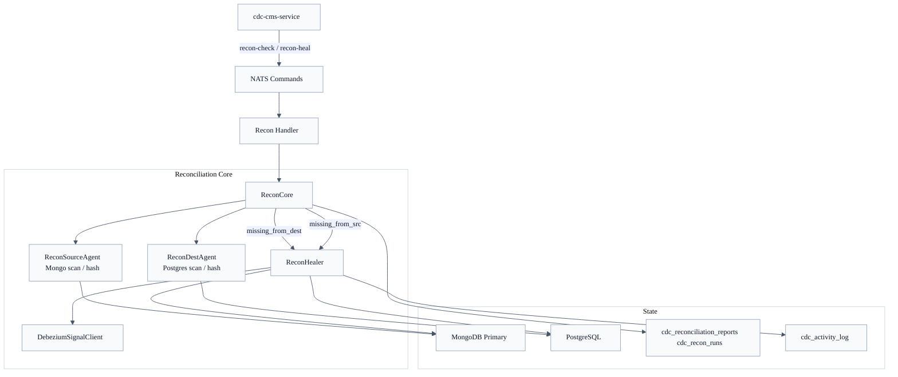

### 6.1 Mục tiêu reconciliation

- phát hiện lệch dữ liệu giữa MongoDB và PostgreSQL
- chuẩn hóa hashing giữa source và destination
- heal missing rows ở đích bằng OCC upsert
- xóa orphaned rows ở PostgreSQL khi source không còn dữ liệu
- ghi audit trail và reconciliation reports để vận hành được ở production

### 6.2 Luồng deep-dive reconciliation

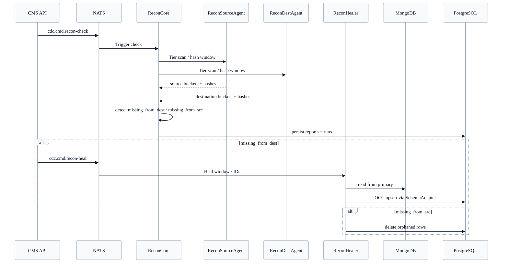

---

## 7. Deep Dive: DLQ and Retry Architecture

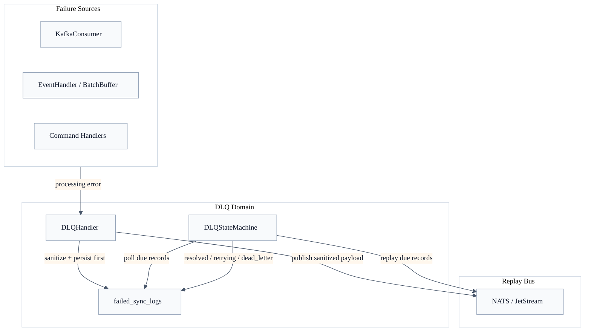

### 7.1 Nguyên tắc DLQ

- write-before-publish: lỗi phải được ghi vào DB trước khi publish replay signal
- non-blocking retry: không dùng sleep chặn worker path
- sanitized payload only: payload ghi vào `failed_sync_logs` phải đã được mask
- state-machine driven retry: việc retry được điều phối qua trạng thái DB thay vì logic tản mạn trong worker loop

### 7.2 DLQ retry lifecycle

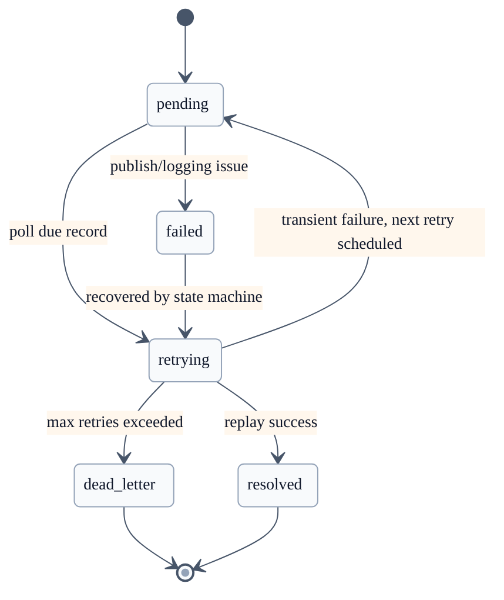

---

## 8. Deep Dive: Schema Evolution Architecture

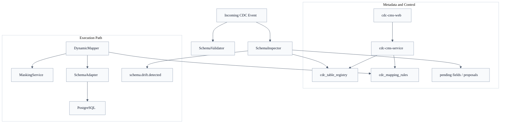

### 8.1 Mục tiêu schema evolution

- phát hiện field mới và drift theo runtime payload
- giữ control plane rõ ràng giữa detect, approve, và apply
- tránh bắn sample PII thô trong alert hoặc metadata staging
- dùng chung `SchemaAdapter` để SQL generation không drift giữa các flow

### 8.2 Schema evolution flow

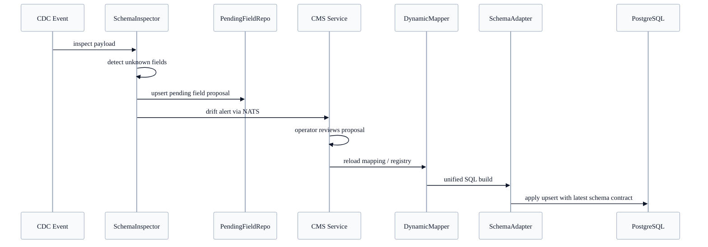

---

## 9. Security and Reliability Notes

### 9.1 Data Protection

- `MaskingService` phải là single shared abstraction cho các flow chứa raw payload.
- `_raw_data`, `failed_sync_logs`, drift sample values phải được sanitize trước khi persist hoặc publish.
- Không phát tán sample PII thô qua NATS alert subjects.

### 9.2 Data Integrity

- hash source/destination cần đồng nhất giữa các reconciliation agents.
- healing phải dùng OCC theo `_source_ts` để tránh overwrite dữ liệu mới hơn.
- Mongo read trong healing nên ép về `primary` để tránh replication lag.

### 9.3 Operability

- state machine và reconciliation phải có audit trail.
- command plane qua NATS cần idempotent và observable.
- các background jobs cần fencing, advisory lock, hoặc leader election khi scale multi-worker.

---

## 10. Suggested Documentation Split

Nếu muốn tách nhỏ tài liệu về sau, có thể chia thành:

- `docs/architecture/01-overview.md`
- `docs/architecture/02-deployment.md`
- `docs/architecture/03-worker-components.md`
- `docs/architecture/04-reconciliation.md`
- `docs/architecture/05-dlq.md`
- `docs/architecture/06-schema-evolution.md`

Hiện tại, file này được giữ ở dạng single-document để thuận tiện paste trực tiếp vào repo.
