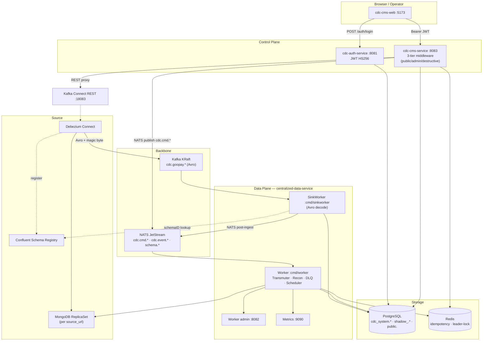
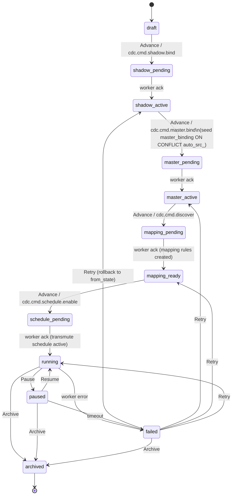
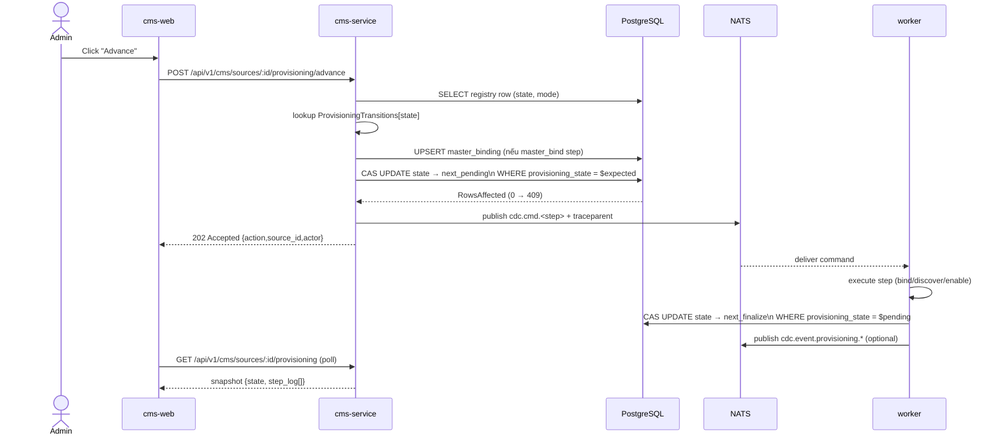

# BRD — CDC System (4 repo)

> **v2.1 — 2026-05-06** · patch §4 (cms-service Hexagonal/CQRS rebuild) + Provisioning Mode subsystem (replace CS3 stub).
> **v2.0 — 2026-04-27** · rewrite từ scratch.
> Nguồn: code path:line + `agent/memory/workspaces/feature-cdc-integration/05_progress.md` (audit log) + `04_decisions_provisioning_mode.md` + `09_*solution*.md`.
> v1.0 (2026-04-27 sáng) đã deprecate: code-as-built thuần, bỏ pivot timeline.

---

## §0. Tóm tắt 1 trang + Critical State

### 0.1 Topology 4 service

| Repo | Vai trò | Stack | Port | Stateful? |
|:-|:-|:-|:-|:-|
| **cdc-auth-service** | Phát JWT (login/register/refresh) | Go 1.26 / Fiber v2 / GORM / PG | :8081 | DB (`auth_users`) |
| **cdc-cms-service** | Control plane API — registry, mapping, schedule, recon, audit | Go 1.26 / Fiber v2 / GORM / PG / Redis / NATS | :8083 | DB share với worker |
| **cdc-cms-web** | Operations UI cho admin/operator | React 19 / Vite 8 / AntD 6 / TanStack Query / TS 5.9 | :5173 dev | localStorage |
| **centralized-data-service** | Data plane — Kafka→shadow→master, recon, DLQ, schedules | Go 1.26 / kafka-go / NATS / GORM / pgx / Mongo / Redis / Sonyflake | :8082 admin + :9090 metrics | Stateful workers (fencing) |

Hai mặt phẳng: **Control plane** (auth + cms-service + cms-web — quản trị metadata) vs **Data plane** (centralized-data-service — pipeline data thực sự).

### 0.2 Critical State 2026-04-27 — đọc trước khi xài

> ⚠ **Nếu bỏ qua box này → người đọc sẽ tưởng plan 1+2 còn hiệu lực.**

| # | Trạng thái | Hệ quả |
|:-:|:-|:-|
| **CS1** | **Airbyte RETIRED hoàn toàn** (Sprint 3, 2026-04-21). `pkgs/airbyte/` xóa vật lý, ~2100 LOC bị cắt. Stub `ShouldUseAirbyte()` luôn `false`. | Plan 1+2 R1 (Airbyte hybrid) chết. Mọi đề cập "Airbyte" trong doc cũ là history. |
| **CS2** | **Backbone CDC events = Kafka (KRaft) + Avro + Schema Registry**. ADR-015 ban đầu chọn NATS JetStream → REVERSED 2026-04-15. | NATS chỉ còn cho `cdc.cmd.*`, `cdc.event.*`, `schema.*` (internal command bus). |
| **CS3** | **Wizard "🚀 Automate Everything" = STUB** (legacy surface). `wizardHandler.Execute` chỉ flip `status=running` + log 1 dòng. ⚠ Đã có **Provisioning Mode** (parallel orchestrator subsystem) thay thế thực sự — xem §4.5.7 + §7.9. Wizard UI cần migrate sang `/api/v1/cms/sources/:id/provisioning/*`. | Wizard route giữ làm legacy compat; Provisioning là canonical kể từ Phase D (2026-04-29). |
| **CS4** | **Schema drift workflow canonical = `schema_proposal`** (migration 025), KHÔNG phải `pending_fields`. Table `pending_fields` vẫn tồn tại (mig 001/005/037) nhưng KHÔNG có code path đọc/ghi. | Plan 1+2 R3 đã pivot 2026-04-07. Pending_fields = dead schema, chưa drop. |
| **CS5** | **Production SLO chưa đo**. Plan 1+2 R9 yêu cầu 50K evt/s, p99<100ms. Local đo được 5,640 rows/sec (bridge load test 2026-04-14). Production p99 unmeasured. | Mọi claim performance là local-only. |
| **CS6** | **2-tier storage**: shadow `cdc_internal.<table>` (Sonyflake `_gpay_source_id` OCC) → master `public.<name>` (post-Transmuter, atomic-swappable). Architecture.md từng vẽ 1 tầng — đó là drift. | Plan 1+2 R2 (JSONB landing zone `_raw_data`) PIVOT: shadow row có `_raw_data JSONB` nhưng KHÔNG còn populate từ Airbyte typed tables. |
| **CS7** | **SinkWorker (`cmd/sinkworker`) chưa có DLQ Phase 1**. Fail = không commit offset → re-deliver vô hạn (sleep 250ms). Worker (`cmd/worker`) ĐÃ có DLQ + state machine — đây là 2 binary khác nhau. | Hot path ingest fragile. |
| **CS8** | **Sonyflake fencing**: machineID claim từ Pod IP qua PG fn (`worker_registry`); heartbeat 30s; mất token = self-terminate. Trigger `tg_sonyflake_fallback` chỉ fire khi `id IS NULL/0` — Go path là authoritative. | Multi-pod safe. |
| **CS9** | **V2 Control Plane = `cdc_system.*` schema** (migrations 029-038). Toàn bộ metadata table di chuyển từ `public.*` sang `cdc_system.*`. Shadow ở `shadow_<db>.*` runtime. Master ở `public.<name>`. | 3-namespace rule: control / shadow / master. |
| **CS10** | **Recon Mongo** disabled khi không config Mongo URI — schedule tick âm thầm skip, không cảnh báo. | Operator có thể tưởng recon đang chạy. |

---

## §1. Lịch sử pivot (chronological — bắt buộc đọc trước plan 1+2)

| Date | Pivot | From → To | Evidence |
|:-|:-|:-|:-|
| 2026-03-26 | Hardcode → Config-driven | M2.4 cố định 3 table → `cdc_table_registry` ~200 table / 30 DB | `05_progress.md:32-34` |
| 2026-03-30 | Tách CMS thành repo riêng | Mono → `cdc-cms-service` :8083 | `05_progress.md:43-48` |
| 2026-04-07 | Bỏ workflow `pending_fields` | pending_fields lifecycle riêng → `mapping_rules` + Scan Source/Fields | `05_progress.md:563` |
| 2026-04-08 | Bridge Airbyte raw → CDC | Direct write assumption → `HandleAirbyteBridge` command + periodic scheduler | `05_progress.md:603-606` |
| 2026-04-13 | Sonyflake migration | Int auto-increment → BIGINT Sonyflake (50GB scale) | `05_progress.md:638` |
| 2026-04-15 | **NATS → Kafka** (ADR-015 reversed) | NATS JetStream all events → Kafka KRaft + Avro + Schema Registry; NATS giữ internal | `05_progress.md:675` |
| 2026-04-16/17 | Recon v3 rewrite | Load full ID set (RAM hog) → streaming XOR-hash 3-tier window (98% RAM↓, <50MB) | `07_status_session_2026_04_17.md:27-30` |
| 2026-04-17 | Sensitive field masking | Hardcode mask → `sensitive_fields JSONB` per-table + `perTableMaskCache` union global | `07_status_NOT_DELIVERED.md:57-62` |
| 2026-04-17 | OTel TraceContext | Logs only → W3C TraceContext + Baggage propagation Kafka headers → SigNoz :4318 | `07_status_NOT_DELIVERED.md:66-70` |
| 2026-04-21 | **Airbyte retired** | Hybrid Debezium+Airbyte → Debezium-only; xóa vật lý ~2100 LOC + `pkgs/airbyte/` | `05_progress.md:842-843` |
| 2026-04-21 | TransmuterModule thay Dynamic Mapper | Phase 2 enrichment plan → `transmuter.go` ~470 LOC + 7-fn whitelist + 2-layer gate | `05_progress.md:842` |
| 2026-04-24 | Shadow/Master 2-tier + Systematic Connect→Master Flow | Single-tier PG → `cdc_internal.*` shadow + `public.<master>`; Wizard state machine; Atomic Swap 1 TX | `05_progress.md:969`, `07_status_systematic_flow.md` |
| Sau 2026-04-24 | V2 Control Plane | `public.*` metadata → `cdc_system.*` (mig 029-038); thêm `connection_registry`, `source_object_registry`, `shadow_binding`, `master_binding`, `mapping_rule_v2` | mig 029-038 |
| 2026-04-29 | **Provisioning Mode subsystem** (Phase D Option-A, Architect ruling D1-D8) | Wizard stateful UI-driven → **Stateless DB-CAS state machine**: 12 states, 4 transitions, dual-side orchestrator (CMS = REST trigger + metadata seed; Worker = step_completed handler + RecoveryLoop TTL sweep). Replace CS3 stub. | `04_decisions_provisioning_mode.md`, `internal/service/provisioning_orchestrator.go` |
| Phase 2 v2 / P2 | **CMS Hexagonal/CQRS rebuild** | Flat `internal/api+model+repository+service` → 4-layer `api / app / domain / infra`. CQRS Q-side (17 query handler), domain aggregates (5 aggregate root), infra adapter (8 GORM read repo + Kafka Connect HTTP client). | `internal/app/`, `internal/domain/`, `internal/infra/` |

---

## §2. Bản đồ tổng thể (current — không phải plan)



**Dòng chính**: Mongo → Debezium (Avro) → Kafka KRaft → SinkWorker → `shadow_<db>.<table>` → Transmuter (NATS-driven) → `public.<master>`.

**Control plane** chỉ chạm metadata + ra lệnh qua NATS, không động vào dữ liệu nghiệp vụ.

---

## §3. Repo 1 — `cdc-auth-service`

### 3.1 Vai trò
Service xác thực trung tâm. Phát JWT access + refresh. FE gọi trực tiếp; cms-service KHÔNG gọi mà tự decode JWT bằng **shared secret**.

### 3.2 Stack
Go 1.26.1 · Fiber v2.52 · GORM v1.31 · pgx v5 · golang-jwt/v5 · bcrypt · Viper · Zap · Swaggo. Không có message bus.

### 3.3 Cấu trúc
```
cmd/server/         Entrypoint
config/             AppConfig + Viper
internal/
  api/              auth_handler.go
  model/            User struct
  repository/       UserRepo (6 method GORM)
  server/           Fiber wiring
  service/          AuthService (login, register, generateTokens)
pkgs/database/      postgres.go
migrations/         001_auth_users.sql (seed admin/admin123 bcrypt)
```

### 3.4 HTTP routes (5)

| METHOD | PATH | Auth | Mục đích |
|:-|:-|:-|:-|
| GET | `/health` | public | Health check |
| POST | `/api/auth/login` | public | Access + refresh |
| POST | `/api/auth/register` | **public** ⚠ | Tạo user (chưa enforce admin-only) |
| POST | `/api/auth/refresh` | refresh bearer | Đổi cặp token mới |
| GET | `/swagger/*` | public | Swagger UI |

### 3.5 Domain logic
- **Token gen** (`auth_service.go:144`) — HS256, 2 token tách: access `{user_id, username, email, role, type:"access"}` + refresh `{user_id, type:"refresh"}`.
- **Login** (`auth_service.go:59`) — query `is_active=true`, bcrypt compare, error type không phân biệt → tránh user enum.
- **Refresh rotation** (`auth_service.go:113`) — sinh cặp mới, **KHÔNG blacklist token cũ**.
- **Role enum** — chỉ `admin` / `operator`.

### 3.6 DB schema
`auth_users`: `id SERIAL PK · username UNIQUE · email UNIQUE · password (bcrypt) · full_name · role CHECK ('admin','operator') DEFAULT 'operator' · is_active · created_at · updated_at`. Index username + role.

### 3.7 Tích hợp
- FE → auth: `VITE_AUTH_API_URL` (`localhost:8081`).
- cms-service ↔ auth: shared `cfg.JWT.Secret`. Rotate phải đồng bộ thủ công.

### 3.8 Gap
1. `fmt.Println(user.Password)` debug log production (`auth_service.go:61,65`) — **P0 security**.
2. Refresh không blacklist sau rotation.
3. `/register` public — bất kỳ ai tạo `role=admin`.
4. JWT secret hardcode `change-me-in-production` trong YAML; Dockerfile copy YAML vào image.
5. Không rate-limit login.
6. Zero test file.
7. Binary `server` ~36MB lưu trong repo.

---

## §4. Repo 2 — `cdc-cms-service`

> **v2.1 patch (2026-05-06)** · §4 viết lại từ scratch. Repo đã đại tu kiến trúc thành **Hexagonal + CQRS** (Phase 2 v2 / P2 rebuild) và bổ sung **Provisioning Mode subsystem** (Phase D Option-A) thay thế Wizard.Execute stub.

### 4.1 Vai trò
Control plane API · **20 handler** nghiệp vụ phục vụ FE: source connector, source object registry (V2 dual-surface), mapping rule, schema proposal, master binding, transmute schedule, reconciliation, alert, system health, audit trail, **provisioning state machine**, introspection. Phát NATS command tới worker; consume CQRS read models cho Q-side queries.

### 4.2 Stack
Go 1.26 · Fiber v2 · GORM · PostgreSQL · Redis (idempotency) · NATS (command publish + request-response) · Zap · Viper · Prometheus client · OpenTelemetry (W3C TraceContext propagation).

### 4.3 Cấu trúc — 4 layer Hexagonal/CQRS

```
cmd/server/main.go
config/config-local.yml            server :8083 + db + nats + redis + JWT secret + otel

internal/
  api/                             20 HTTP handler (Fiber) — 1 file/domain
                                     auth_handler · audit_handler · alert_handler
                                     approval_handler · failed_sync_handler
                                     health_handler · introspection_handler ← v2.1
                                     mapping_handler · master_handler
                                     provisioning_handler ← v2.1 (7 endpoints)
                                     recon_handler · registry_handler
                                     schedule_handler · schema_handler
                                     source_object_actions_handler ← v2.1 (V2 dual-surface)
                                     source_objects_handler ← v2.1 (CQRS Q-side, 4 GET)
                                     system_connectors_handler · tools_handler
                                     wizard_handler · error_messages_vi

  app/                             ← Hexagonal "application" layer (v2.1)
    commands/                        (placeholder — doc.go; commands chạy qua handler hiện tại)
    queries/                         **17 query handler** (CQRS Q-side):
                                       list_source_objects · get_source_object_mapping_context
                                       list_shadow_bindings · ... (read-only handler trả DTO)
    queries/read_models/             3 file DTO bất biến (read model schema)
    ports/                           4 interface contract:
                                       command_bus.go · publisher.go
                                       query_bus.go · repository.go

  domain/                          ← Aggregate roots (v2.1) — pure Go, không import DB
    job/         · mapping/        · master/
    reconciliation/ · source/      (5 aggregate, 6 file)

  infra/                           ← Adapter (v2.1)
    cache/                           Redis impl
    http/                            Kafka Connect REST client
    messaging/                       NATS publisher + subscriber
    persistence/                     **8 GORM read-repo** impl `app/ports/repository.go`

  service/                         **11 service**:
                                     approval_service · shadow_automator · master_swap
                                     reconciliation_service · alert_manager · prom_client
                                     system_health_collector · alerts
                                     provisioning_orchestrator ← v2.1 (729 LOC)
                                     provisioning_state_machine ← v2.1 (76 LOC, pure FSM)
                                     source_object_v2_sync ← v2.1

  model/                           14 GORM struct (thêm SourceObjectRegistry, MasterBinding,
                                   WizardSession + provisioning_* columns)
  repository/                      1:1 với model

  middleware/
    jwt.go                         Parse Bearer
    rbac.go                        RequireRole · RequireOpsAdmin
    idempotency.go                 RFC draft-ietf-httpapi-idempotency-key-05
    audit.go                       Async admin_actions, reason ≥10 chars
    ratelimit.go                   Restart 3/h/user

  router/router.go                 3-tier middleware chain · ~98 route
  server/server.go                 DI bootstrap (wire `app.queries` + `infra.persistence`)

migrations/                        4 file riêng (003,004,005,013) — core schema ở worker repo
docs/                              Swagger
```

**Quy ước layer**: `api/*` chỉ depend `app/*` (qua port) + `service/*`. `domain/*` không import bất kỳ infra package nào. `infra/persistence/*` implement `app/ports/repository.go`. Đây là quy ước Hexagonal — vi phạm = lỗi build review.

### 4.4 HTTP routes — 3 tier (~98 route)

**Tier 1 — Destructive** (`JWTAuth → RequireOpsAdmin → Idempotency → Audit`):

| METHOD | PATH | Mục đích |
|:-|:-|:-|
| POST | `/v1/system/connectors` | Tạo Debezium connector + upsert sources |
| POST | `/v1/system/connectors/:name/{restart\|pause\|resume}` | Lifecycle |
| POST | `/v1/system/connectors/:name/tasks/:id/restart` | Restart task |
| DELETE | `/v1/system/connectors/:name` | Xóa + soft-delete sources |
| POST | `/v1/masters` + `/v1/masters/:n/{approve\|reject\|toggle-active}` | Master state |
| POST | `/v1/masters/:n/swap` | **Atomic RENAME 1 TX** |
| POST | `/v1/wizard/sessions/:id/execute` | **STUB legacy** — Provisioning Mode replace (CS3) |
| POST | `/v1/schema-proposals/:id/{approve\|reject}` | Approve = ALTER + INSERT mapping rule (1 TX) |
| POST | `/v1/schedules` + `/v1/schedules/:id/run-now` + PATCH | Transmute schedule |
| POST | `/v1/mapping-rules/preview` | gjson eval 3 sample |
| POST | `/reconciliation/{check, check/:t, heal/:t}` | Trigger recon |
| POST | `/failed-sync-logs/:id/retry` | DLQ retry |
| POST | `/tools/{reset-debezium-offset, trigger-snapshot/:t}` | Worker tools |
| POST (rate-limit 3/h/user) | `/tools/restart-debezium` | |
| POST | `/recon/backfill-source-ts` | Background backfill |
| POST | `/alerts/:fingerprint/{ack, silence}` | Alert state |
| POST | `/api/v1/cms/sources/:id/provisioning/{advance,pause,resume,retry,archive,mode}` | **Provisioning Mode** ← v2.1 (6 destructive) |

**Tier 2 — Admin-only** (`RequireRole admin`):

| METHOD | PATH | Mục đích |
|:-|:-|:-|
| POST + PATCH | `/registry`, `/registry/:id`, `/registry/batch` | Source object register (legacy) |
| POST | `/registry/scan-source`, `/registry/:id/{sync, scan-fields, transform, standardize, discover, drop-gin-index, create-default-columns, detect-timestamp-field, dispatch-status, transform-status}` | Async dispatch (legacy bridge) |
| POST + PATCH | `/api/v1/source-objects/:id`, `/api/v1/source-objects/:id/{create-default-columns, scan-fields, standardize, dispatch-status, detect-timestamp-field, transform-status}` | **V2 direct** ← v2.1 (dual-surface) |
| POST + PATCH | `/mapping-rules`, `/mapping-rules/{batch, :id}` | Mapping CRUD |
| POST | `/mapping-rules/reload`, `/mapping-rules/:id/backfill` | Reload + backfill |
| POST | `/schema-changes/:id/{approve, reject}` | Schema approval |
| POST + PATCH | `/worker-schedule`, `/worker-schedule/:id` | |
| POST + PATCH | `/v1/wizard/sessions`, `/v1/wizard/sessions/:id` | Draft + edit (re-tier 2026-04-24) |

**Tier 3 — Shared (admin + operator) read-only**: ~30 GET endpoint cho registry, mappings, schemas, masters, sources, alerts, recon report, activity log, system health, **+ V2 source-objects** (`GET /api/v1/source-objects[/stats|/registry/:id]`, `GET /api/v1/shadow-bindings`), **+ Provisioning** (`GET /api/v1/cms/sources/:id/provisioning` snapshot), **+ Introspection** (`GET /api/introspection/scan/:table`, `/scan-raw/:table` — NATS request-response 10 s timeout).

### 4.5 Domain logic

- **AuditLogger** (`middleware/audit.go:88`) — async pipeline, queue 100, reason ≥10 chars (`auditReasonMin = 10`), payload cap 64 KiB, drop-oldest.
- **Idempotency** (`middleware/idempotency.go:113`) — Redis TTL 1h, key `<scope>:<user>:<header>`, replay cached response.
- **RequireOpsAdmin** (`rbac.go:133`) — accept `ops-admin` OR legacy `admin` (widening tạm; chờ IdP rollout).
- **ApprovalService** — Approve schema proposal trong 1 TX: ALTER shadow + INSERT mapping rule.
- **ShadowAutomator** (`service/shadow_automator.go`) — `EnsureShadowTable` synchronous: validate ident → ensure Sonyflake fn → create 8-col shadow → attach trigger → mark `is_table_created=true`.
- **MasterSwap** (`service/master_swap.go`) — `BEGIN; SET LOCAL lock_timeout='3s'; ALTER RENAME current→_old, ALTER RENAME v2→current; COMMIT;` — 409 nếu lock timeout.
- **WizardSession state machine** (`api/wizard_handler.go`) — UUID v4, 4 status `draft|running|done|failed`, JSONB `step_payload` + `progress_log`, allow-list field cho Patch. **Execute = stub legacy** (CS3) — Provisioning Orchestrator là canonical thay thế.
- **SystemConnectorsHandler** — REST proxy sang Kafka Connect; tail upsert `cdc_system.sources` với fingerprint sanitized.

#### 4.5.7 ProvisioningOrchestrator — canonical "Automate Everything" (v2.1)

**Vị trí**: `internal/service/provisioning_orchestrator.go` (729 LOC) + `provisioning_state_machine.go` (76 LOC, **byte-equivalent** với worker copy — D6 ruling).

**State machine — 12 state · 4 transition**:

```
draft ──shadow_bind──▶ shadow_pending ─(worker ack)─▶ shadow_active
shadow_active ──master_bind──▶ master_pending ──▶ master_active
master_active ──discover──▶ mapping_pending ──▶ mapping_ready
mapping_ready ──schedule_enable──▶ schedule_pending ──▶ running
running ⇄ paused           (Pause/Resume)
any   → failed → from_state (Retry)
any   → archived           (Archive · terminal)
provisioned                (D4 — legacy backfill terminal, không trong Transitions)
```

**4 NATS subject mới** (worker subscribe; xem §6.7):
| State trigger | Subject | Pending → Finalize |
|:-|:-|:-|
| `draft` | `cdc.cmd.shadow.bind` | shadow_pending → shadow_active |
| `shadow_active` | `cdc.cmd.master.bind` | master_pending → master_active |
| `master_active` | `cdc.cmd.discover` | mapping_pending → mapping_ready |
| `mapping_ready` | `cdc.cmd.schedule.enable` | schedule_pending → running |

**CAS update pattern** (D6 — bắt buộc cho mọi UPDATE state):

```sql
UPDATE cdc_system.source_object_registry
SET provisioning_state = $next,
    provisioning_step_log = cdc_system.append_step_log_capped(provisioning_step_log, $entry::jsonb, $cap),
    last_step_error = $err, updated_at = now()
WHERE id = $id AND provisioning_state = $expected
```

`RowsAffected == 0` → trả `ErrProvisioningConflict` (HTTP 409 — "state changed concurrently — retry after refreshing"). Không có CAS = race với worker → state corruption.

**Step-specific seed**: trước khi `Advance` từ `shadow_active` → `master_pending`, orchestrator UPSERT `cdc_system.master_binding` với `binding_code = 'auto_src_<source_id>'` (idempotent ON CONFLICT), tránh worker fail vì missing binding.

**OTel propagation** (D8): `injectProvisioningTraceContext` chèn `traceparent` vào NATS message header → worker continue trace span.

**HTTP surface** (`api/provisioning_handler.go` · 222 LOC):
| METHOD | PATH | Tier | Mô tả |
|:-|:-|:-|:-|
| GET | `/api/v1/cms/sources/:id/provisioning` | shared | Snapshot (state + mode + step_log) |
| POST | `…/advance` | destructive | Fire next transition (state machine lookup) |
| POST | `…/pause` · `…/resume` · `…/retry` | destructive | Lifecycle |
| POST | `…/archive` | destructive | Terminal |
| POST | `…/mode` body `{"mode":"auto\|manual"}` | destructive | Flip auto/manual |

Error map: `ErrSourceNotFound→404`, `ErrInvalidTransition→422`, `ErrConflict→409`, default→500.

#### 4.5.8 V2 dual-surface routing pattern (v2.1)
`source_object_actions_handler.go` wrap `RegistryHandler` cho **2 surface song song**:
- **Legacy bridge**: `/api/v1/source-objects/registry/:registry_id/*` — FE cũ (Schedule Panel, ScanFields modal) gọi qua `registry_id` (PK của shadow row).
- **V2 direct**: `/api/v1/source-objects/:source_object_id/*` — FE mới gọi qua `source_object_id`; handler resolve → JOIN `source_object_registry × shadow_binding` (status='active'), 409 nếu >1 active binding.

Cùng business logic, 2 URL space — migration không phá FE cũ.

### 4.6 DB schema

cms-service không own toàn bộ schema (38 migration ở worker repo). Chỉ 4 migration riêng:
- `003_add_mapping_rule_status.sql`
- `004_bridge_columns.sql`
- `005_admin_actions.sql` — audit
- `013_alerts.sql`

**Provisioning columns trên `cdc_system.source_object_registry`** (worker mig 035-038):
| Column | Type | Mặc định | Vai trò |
|:-|:-|:-|:-|
| `provisioning_mode` | TEXT | `'auto'` | `auto` / `manual` |
| `provisioning_state` | TEXT | `'draft'` | 1 trong 12 state |
| `provisioning_step_log` | JSONB | `'[]'::jsonb` | Append-only log capped (default 50 entry) |
| `last_step_error` | TEXT | `NULL` | Last error message |
| `provisioning_updated_at` | timestamptz | `now()` | CAS witness |

**PG fn** `cdc_system.append_step_log_capped(log JSONB, entry JSONB, cap INT) RETURNS JSONB` — append rồi cắt đầu log nếu vượt cap. Env override `PROVISIONING_STEP_LOG_MAX` (default 50).

### 4.7 Tích hợp
- **JWT**: shared secret với cdc-auth-service.
- **Worker NATS**: publish `cdc.cmd.*` (xem §6.7); subscribe dispatch-status để FE poll.
- **CQRS Q-side**: `app/ports/repository.go` định nghĩa contract; `infra/persistence/*` cung cấp 8 GORM read-repo. `api/source_objects_handler.go` chỉ depend `app/queries.*` (không touch GORM trực tiếp).
- **Kafka Connect REST**: `system.kafkaConnectUrl` (`localhost:18083`).
- **Redis**: idempotency cache + dispatch-status key.
- **Prometheus**: scrape worker `:9090`.
- **OpenTelemetry**: W3C TraceContext propagation qua NATS header (provisioning + dispatch).
- **DB**: cùng instance PostgreSQL `goopay_dw` với worker.

### 4.8 Pattern
- **3-tier middleware** với comment cảnh báo Fiber `Group("",mw).Use` quirk (`router.go:90-99`): destructive routes phải mount TRƯỚC shared/admin Groups vì `Use` leak xuống.
- **registerDestructive helper** clone chain per-route, không Group-with-Use.
- **Idempotency-Key + reason ≥10 chars** RFC compliant.
- **CAS update (Compare-And-Swap)** — mọi UPDATE state phải pair `From` value với `WHERE provisioning_state = $expected`. RowsAffected==0 → 409 conflict (D6 ruling). Áp dụng cho `source_object_registry.provisioning_state` (orchestrator) và `wizard_sessions.status` (legacy).
- **Dual-surface V2** — legacy bridge + V2 direct cùng wrap 1 handler core; phục vụ migration FE không downtime.
- **Hexagonal + CQRS** — api → app(ports) → infra; domain pure. Q-side query handler trả DTO read-model bất biến.
- **Append-only step log** capped via PG fn (không read-modify-write từ Go → tránh race).
- **Pure FSM duplicated** — `provisioning_state_machine.go` byte-equivalent ở cả cms-service và centralized-data-service (no module replace; DB là source of truth).

### 4.9 Gap
1. **Wizard.Execute UI vẫn gọi stub** — backend đã có Provisioning Mode (canonical), FE `SourceToMasterWizard.tsx` chưa migrate sang `/api/v1/cms/sources/:id/provisioning/*`. **P1** (giảm từ P0 vì có replace path).
2. `cdc_internal_registry_handler.go` orphan (file còn, router không wire).
3. Bridge route đã remove, handler có thể vẫn còn code dead.
4. Audit log retention chưa rõ — `admin_actions` không partition.
5. Migration scattered: cms 4 file rời rạc, không liên tiếp với worker 38 file — dễ bỏ sót.
6. **`app/commands/` mới chỉ có `doc.go`** — Hexagonal C-side chưa được rút khỏi `service/*` và `api/*`. Migration nửa chừng. **P2**.
7. **Provisioning step log chưa có UI render** — JSONB log có sẵn nhưng FE chưa hiển thị timeline.

---

## §5. Repo 3 — `cdc-cms-web`

### 5.1 Vai trò
Operations UI cho admin/operator. 15 page cover toàn bộ CDC pipeline lifecycle.

### 5.2 Stack
React 19.2 · react-dom 19.2 · Vite 8 · TS 5.9 · AntD 6.3 · @ant-design/icons 6.1 · @tanstack/react-query 5.59 · react-router-dom 7.13 · axios 1.14.

State: React Query (server) + useState/useCallback (local). **Không có Redux/Zustand** — auth ở `localStorage` thẳng.

### 5.3 Cấu trúc
```
src/
  App.tsx                Router shell + ProtectedRoute + lazy import
  main.tsx               QueryClient (staleTime 25s, retry 2) + DevTools
  pages/                 15 page (1 file = 1 route)
  components/            5 shared (modal, badge, boundary, form, button)
  hooks/                 4 hook nghiệp vụ
  services/api.ts        3 axios: authApi, cmsApi, workerApi
  types/index.ts         DTO interface
  constants/reconErrorMessages.ts
```

### 5.4 Pages

| Route | File | Mục đích |
|:-|:-|:-|
| `/login` | Login.tsx | Login → token vào localStorage |
| `/` | Dashboard.tsx | Tổng quan registry + pending + sync health |
| `/source-to-master` | SourceToMasterWizard.tsx | Wizard 11 bước (BE Execute = stub — CS3) |
| `/sources` | SourceConnectors.tsx | CRUD Debezium connector |
| `/registry` | TableRegistry.tsx | Source object — register, scan-fields, snapshot |
| `/registry/:id/mappings` | MappingFieldsPage.tsx | Mapping rules per source |
| `/masters` | MasterRegistry.tsx | Khai báo + approve master binding |
| `/schema-proposals` | SchemaProposals.tsx | Duyệt schema drift (canonical — không phải pending_fields) |
| `/schedules` | TransmuteSchedules.tsx | Lịch transmute |
| `/activity-log` | ActivityLog.tsx | Audit/activity timeline |
| `/data-integrity` | DataIntegrity.tsx | Recon report + heal + retry DLQ |
| `/system-health` | SystemHealth.tsx | Infra/pipeline/recon health |
| `/schema-changes` | SchemaChanges.tsx | Lịch sử DDL |
| `/activity-manager` | ActivityManager.tsx | Schedule nâng cao |
| `/cdc-internal` → `/registry` | redirect | Backward compat |
| `/queue` → `/system-health` | redirect | Backward compat |

**Orphan files**: `CDCInternalRegistry.tsx`, `QueueMonitoring.tsx` — tồn tại trên disk, không trong App.tsx.

### 5.5 Hooks nghiệp vụ
- **useAsyncDispatch** (`hooks/useAsyncDispatch.ts:92`) — generic 202 + poll: POST → poll `GET /dispatch-status?subject&since&target_table`. Idempotency-Key = UUID; X-Action-Reason header. State `idle→dispatching→accepted→running→success/error/timeout`. Default timeout 5min, poll 3s.
- **useRegistry** — `useScanFields`, `useRestartDebezium`.
- **useReconStatus** — recon report (refetch 30s) + 4 mutation (check/heal/retry/backfill) đều gắn audit headers.
- **useSystemHealth** — health (refetch 30s) + restartConnector (Idempotency-Key + X-Action-Reason).

### 5.6 API client
- `authApi` (8081) — không interceptor.
- `cmsApi` (8083) — request inject `Authorization: Bearer <localStorage.access_token>`; response 401 → clear storage + `window.location.href = '/login'` (hard redirect, KHÔNG qua React Router) — `services/api.ts:29`.
- `workerApi` (8082) — chưa có page nào gọi trực tiếp.

**Không có refresh-token flow auto** — token hết hạn = logout.

### 5.7 Convention
- **Idempotency-Key**: hooks dùng `crypto.randomUUID()`; pages dùng `<scope>-<verb>-<param>-${Date.now()}`. **Không thống nhất**.
- **Reason ≥10 chars**: enforced trong `ConfirmDestructiveModal.tsx:35` (`MIN_REASON_LENGTH = 10`); button disabled. Không phải mọi action qua modal — `ReDetectButton.tsx:42` hardcode reason.
- **Error toast**: `message.error(e.response?.data?.error || '<fallback>')` — đồng nhất.
- **Code-split**: tất cả page `lazy()` + `vite.config.manualChunks`.

### 5.8 Gap
1. SourceToMasterWizard chưa dùng React Query — useEffect/useState raw, không có cache invalidation chuẩn.
2. TableRegistry source dropdown — `collectionOptions` parse `collection_include_list`; null → dropdown rỗng, không loading/error state.
3. 2 file orphan (CDCInternalRegistry, QueueMonitoring).
4. No refresh-token flow — token hết = hard redirect.
5. 5+ page dùng pattern cũ (useEffect+useState+fetchData): ActivityLog, ActivityManager, SchemaChanges, Dashboard chưa migrate React Query.
6. Legacy compat dead code — SystemHealth.tsx:103-106 cast `legacy` field map; MasterRegistry.tsx:247 giữ identifier `source_shadow`.

---

## §6. Repo 4 — `centralized-data-service` (Data plane)

### 6.1 Vai trò
**Worker plane** — nơi data thực sự chạy. Consume Kafka Avro từ Debezium → ghi shadow → transmute sang master. Phát hiện drift, heal, DLQ retry, schedule cron, alert. Đối lập với cms-service (control plane).

### 6.2 Stack
Go 1.26.1 · kafka-go v0.4.50 · nats.go v1.50 · GORM + pgx v5 · mongo-driver v1.17 · robfig/cron v3 · go-redis v9 · linkedin/goavro v2.15 · sony/sonyflake v1.3 · tidwall/gjson · Fiber v2 (admin :8082) · prometheus client · OTel v1.43 · sony/gobreaker.

### 6.3 Cấu trúc
```
cmd/
  sinkworker/main.go     Binary riêng cho Debezium→shadow (v1.25)
  worker/main.go         Binary chính: WorkerServer wiring
  profile_table/         CLI export profiling YAML

internal/
  server/worker_server.go    DI container, schedule poller, NATS subscribe registry
  handler/
    kafka_consumer.go        KafkaConsumer (legacy path)
    command_handler.go       NATS cdc.cmd.* dispatcher
    transmute_handler.go     NATS cdc.cmd.transmute + transmute-shadow
    master_ddl_handler.go    NATS cdc.cmd.master-create
    recon_handler.go         NATS recon-* + backfill + timestamp detect
    event_handler.go         Xử lý event từ ConsumerPool
    batch_buffer.go          Batch flush
    dlq_handler.go           Write-to-DLQ + re-publish (Worker, KHÔNG phải SinkWorker)
    dlq_state_machine.go     Poll 5min, exponential backoff retry
    consumer_pool.go         NATS JetStream consumer pool
    event_bridge.go          Bridge legacy → format mới

  sinkworker/
    sinkworker.go            Core 6-step pipeline
    schema_manager.go        EnsureShadowTable + auto-ALTER + proposal emit
    upsert.go                buildUpsertSQL với OCC `_source_ts` + fencing
    envelope.go              Avro/JSON decode + topic→shadow mapping

  service/
    transmuter.go              Shadow→master, mapping rule cache 60s
    transmute_scheduler.go     Cron poll 60s + FOR UPDATE SKIP LOCKED
    recon_core.go              3-tier window streaming XOR-hash + leader election
    recon_source_agent.go      Mongo scan/hash
    recon_dest_agent.go        PG shadow/master scan/hash
    recon_heal.go              ReconHealer + Debezium signal client
    backfill_source_ts.go      Tier-4: backfill _source_ts từ Mongo updatedAt/ObjectID
    schema_inspector.go        Drift detect → publish schema.drift.detected
    schema_validator.go        Validate expected fields trước commit Kafka offset
    dynamic_mapper.go          Map event với mapping rule (legacy)
    master_ddl_generator.go    DDL master + RLS
    dlq_worker.go              DLQ Prometheus gauge
    partition_dropper.go       Daily DROP partition monthly
    full_count_aggregator.go   Daily Mongo count vs PG COUNT(*)
    timestamp_detector.go      Auto detect timestamp field từ Mongo

  model/         GORM struct registry
  repository/    Data access per model

config/        AppConfig: Server, DB, SystemDB, ShadowDB, MasterDB,
               Nats, Redis, Worker, Kafka, Otel, MongoDB, Debezium

migrations/    38 file SQL — chạy thủ công (GORM AutoMigrate disabled)

pkgs/
  idgen/         Sonyflake wrapper
  natsconn/      NatsClient + EnsureStreams (CDC_EVENTS, SCHEMA_DRIFT, SCHEMA_CONFIG)
  kafka/         Kafka helper
  database/      NewPostgresConnection, NewPgxPool, ReadReplica
  mongodb/       MongoClient (per source_url multi-pool)
  rediscache/    Redis wrapper
  metrics/       Prometheus :9090
  observability/ OTel + W3C TraceContext propagator + severity-aware sampler
```

### 6.4 Worker lineup

| Worker | Entrypoint | Input | Output |
|:-|:-|:-|:-|
| **SinkWorker** | `cmd/sinkworker/main.go` | Kafka regex `^cdc\.goopay\..*` (Avro) | shadow + NATS `cdc.cmd.transmute-shadow` |
| **KafkaConsumer (legacy)** | `handler/kafka_consumer.go` | Kafka prefix từ config | `failed_sync_logs`, event pipeline |
| **NATS ConsumerPool** | `handler/consumer_pool.go` | JetStream `cdc.goopay.>` | shadow qua EventHandler+BatchBuffer |
| **TransmuteScheduler** | `service/transmute_scheduler.go` | Poll 60s `transmute_schedule` SKIP LOCKED | NATS `cdc.cmd.transmute` |
| **TransmuterModule** | `service/transmuter.go` | NATS `cdc.cmd.transmute` / `transmute-shadow` | master + `sync_runtime_state` |
| **DLQStateMachine** | `handler/dlq_state_machine.go` | Poll `failed_sync_logs` 5min | NATS replay + status update |
| **ReconciliationCore** | `service/recon_core.go` | NATS `recon-check` + 30min schedule | `cdc_reconciliation_report` + `recon_runs` |
| **ReconHealer** | `service/recon_heal.go` | NATS `recon-heal` | Debezium signal + PG upsert |
| **BackfillSourceTs** | `service/backfill_source_ts.go` | NATS `recon-backfill-source-ts` | shadow `_source_ts` UPDATE |
| **PartitionDropper** | `service/partition_dropper.go` | Daily ticker | DROP partition `cdc_activity_log` monthly |
| **FullCountAggregator** | `service/full_count_aggregator.go` | Daily 03:00 UTC cron | `cdc_table_registry.full_*_count` |
| **SchedulePoller** | `worker_server.go:517` | Ticker 60s `cdc_worker_schedule` | NATS publish theo operation |

### 6.5 Domain logic critical
- **SinkWorker pipeline 6-step** (`sinkworker.go:91`) — Avro decode (Confluent magic byte `\0\0\0\0\0`+schemaID) → extract op+after+`_gpay_source_id` → build 10 system field + SHA-256 hash → merge business field (skip `_gpay_*`) → SchemaManager EnsureShadowTableInSchema → upsert OCC fencing 1 TX. Post-ingest publish NATS fire-and-forget.
- **SchemaManager** (`schema_manager.go:79`) — so column `information_schema` với record key; field mới: financial blocked / >100 ALTER/24h blocked → `schema_proposal`; còn lại auto-ALTER. Financial cache 60s.
- **Transmuter gate chain** (`transmuter.go:129`) — load master binding → check `is_active=true AND schema_status='approved'` (master) → `is_active AND profile_status='active'` (shadow) → load rule cache 60s → fetch shadow batch theo `_gpay_id` cursor → buildMasterRow gjson + transform_fn whitelist (7 hàm) → upsert master `ON CONFLICT WHERE _hash IS DISTINCT FROM`.
- **Sonyflake fallback** (`migrations/028_sonyflake_fallback_fn.sql:9`) — `[42 ts ms từ 2026-01-01][16 machine_id][6 seq]` BIGINT. Trigger `tg_sonyflake_fallback` chỉ fire `NEW.id IS NULL OR 0` — Go path authoritative.
- **Heartbeat/fencing** (`cmd/sinkworker/main.go:232`) — claim machine_id 1-65535 qua PG fn; heartbeat 30s; reclaim → `cancel()`.
- **Recon 3-tier window** (`recon_core.go`) — Tier1 count drift, Tier2 streaming XOR-hash ID set diff (RAM <50MB), Tier3 off-peak full scan 02:00-05:00. Leader election Redis lock TTL 60s, heartbeat 20s.
- **Recon feedback loop** — `cdc_table_registry` thêm `sync_status`, `last_recon_at`, `recon_drift` (per-table %). Wire vào `/api/system/health`.
- **Multi-source MongoDB** — `source_url` per registry row → MongoClient pool theo URL fingerprint. `cdc_system.sources` (mig 027) lưu connection meta.
- **DLQ backoff** (`dlq_state_machine.go`) — pickup `status IN (pending,failed,retrying)`, backoff 1m→5m→30m→2h→6h→dead_letter (5 lần). **Worker scope, KHÔNG phải SinkWorker** (xem CS7).
- **Sensitive field masking** (mig 014) — `sensitive_fields JSONB DEFAULT '[]'` per table. `perTableMaskCache` union global+per-table (không override). Seed: `refund_requests = ["email","phone","national_id"]`.
- **OTel TraceContext** — W3C `traceparent`/`tracestate` extract từ Kafka message header → parent span; OTLP HTTP exporter → SigNoz `:4318`.

### 6.6 DB schema (38 migration)

**Schema namespace evolution**:
- `public.*` — legacy 001-028, di chuyển sang `cdc_system` ở migration 037.
- `cdc_internal.*` — v1.25 foundation 018-028 (worker_registry, schema_proposal, fencing fns, sonyflake).
- `cdc_system.*` — V2 control plane 029-038 (V2 registries + tất cả legacy đã migrate).
- `shadow_<db>.*` — runtime tạo bởi SchemaManager.
- `public.<master>` — runtime tạo bởi MasterDDLGenerator.

**Bảng trọng yếu** (sau mig 037-038, đều ở `cdc_system.*`):
- `cdc_table_registry` (legacy registry — `expected_fields`, `is_active`, `timestamp_field`, `source_url`, `sensitive_fields`, `sync_status`, `last_recon_at`, `recon_drift`, `full_*_count`)
- `cdc_mapping_rules` (legacy)
- `cdc_activity_log` (RANGE partition monthly)
- `failed_sync_logs` (DLQ partition + state machine cols)
- `cdc_reconciliation_report`, `recon_runs`
- `cdc_worker_schedule`, `schema_changes_log`
- `connection_registry`, `source_object_registry`, `shadow_binding`, `master_binding` (V2)
- `mapping_rule_v2` (`source_path` JSONPath + `transform_fn`)
- `sync_runtime_state`, `transmute_schedule`
- `worker_registry` (machine_id fencing)
- `schema_proposal` (drift workflow canonical)
- **`sources`** + **`cdc_wizard_sessions`** (Systematic Flow mig 027)
- `pending_fields` ⚠ — **dead schema** (CS4): table còn nhưng workflow retire 2026-04-07, chưa drop migration

**Migration milestones**:
- 001 init schema · 003 sonyflake_schema · 005 pg_users · 006+010 partition activity_log · 012 DLQ state machine
- 014 sensitive_fields · 018 Sonyflake v1.25 foundation · 025 schema_proposal
- 027 systematic_sources + wizard sessions · 028 Sonyflake fallback fn
- 029-034 V2 control plane · 037-038 namespace consolidation

### 6.7 Kafka / NATS surface

**Kafka consume**:
- SinkWorker regex `^cdc\.goopay\..*` (resolved 1 lần lúc startup — không re-discover, xem §6.9 #1).
- Pattern `cdc.<connector>.<db>.<collection>` → `shadow_<db>.<collection>`.
- Group: `cdc-v125-sink-worker`.
- **Wire format**: Confluent Avro qua `AvroConverter` + `schema.registry.url`. Magic byte `\0\0\0\0\0` + 4-byte schemaID lookup Schema Registry. `ByLogicalTableRouter` đã xóa (gây DataException với MongoDB envelope).

**NATS streams** (`pkgs/natsconn/nats_client.go:63`):
- `CDC_EVENTS` ← `cdc.goopay.>`
- `SCHEMA_DRIFT` ← `schema.drift.detected`
- `SCHEMA_CONFIG` ← `schema.config.reload`

**NATS command subjects** (worker subscribe, CMS publish):
```
cdc.cmd.standardize · discover · backfill · scan-raw-data · batch-transform
        periodic-scan · drop-gin-index · create-default-columns
        scan-fields · sync-register · sync-state · restart-debezium · alter-column
        transmute · transmute-shadow · master-create
        recon-check · recon-heal · retry-failed
        debezium-signal · debezium-snapshot
        recon-backfill-source-ts · detect-timestamp-field
        introspect

# Provisioning Mode (v2.1) — dot-form (KHÔNG dash, khác master-create)
cdc.cmd.shadow.bind        ← state draft         → shadow_pending
cdc.cmd.master.bind        ← state shadow_active → master_pending
cdc.cmd.discover           ← state master_active → mapping_pending
cdc.cmd.schedule.enable    ← state mapping_ready → schedule_pending
```

**NATS request-response** (cms-service blocking call, worker reply, 10 s timeout):
- `cdc.cmd.introspect` — `GET /api/introspection/scan/:table` (introspect_handler).
- `cdc.cmd.scan-raw-data` — `GET /api/introspection/scan-raw/:table`.

**NATS publish (worker outbound)**:
- `cdc.cmd.transmute-shadow` — SinkWorker post-ingest.
- `cdc.cmd.transmute` — TransmuteScheduler.
- `schema.drift.detected` — SchemaInspector.
- `cdc.cmd.scan-raw-data | periodic-scan | batch-transform` — SchedulePoller.

### 6.8 Pattern
- **Idempotent upsert OCC**: Shadow `ON CONFLICT (_gpay_source_id) WHERE NOT _gpay_deleted DO UPDATE WHERE _source_ts IS NULL OR EXCLUDED._source_ts > table._source_ts`. Master `ON CONFLICT DO UPDATE WHERE _hash IS DISTINCT FROM`.
- **Snapshot dùng DO NOTHING** — không đè streaming update.
- **Fencing multi-pod**: machine_id claim + heartbeat 30s + self-terminate khi token bị reclaim.
- **TransmuteScheduler SKIP LOCKED** + advisory lock cho multi-instance.
- **Mapping rule cache TTL 60s** — KHÔNG event-invalidate (xem §6.9 #3).
- **Streaming XOR-hash recon** — không load full ID set vào RAM.
- **Avro magic byte**: `[\x00 \xXX \xXX \xXX \xXX][payload]` — schema lookup Registry.

### 6.9 Gap
1. **SinkWorker không re-discover topic** khi Debezium thêm collection mới — phải restart thủ công (`cmd/sinkworker/main.go:117-119`).
2. **SinkWorker không có DLQ Phase 1** — fail = không commit offset → re-deliver vô hạn, chỉ `time.Sleep(250ms)`. Worker (cmd/worker) ĐÃ có DLQ — đây là 2 binary khác nhau.
3. **Transmuter cache không event-invalidate** — `schema.config.reload` xóa Redis schema cache nhưng Transmuter vẫn dùng rule cũ tới 60s.
4. **KafkaConsumer legacy auto-commit `CommitInterval: 1s`** — at-most-once, có thể mất message nếu fail sau commit.
5. **TransmuteScheduler hardcode machine_id/fencing_token = 0** trong dev (`worker_server.go:265`) — production phải wire claim riêng.
6. **Transmuter không live-check shadow `is_active`** — cache 60s, admin flip flag mất ≤60s.
7. **SchemaManager column cache không TTL** — sau ALTER rollback / DROP COLUMN thủ công, cache stale tới restart.
8. **`cdc.goopay.>` hardcode** trong ConsumerPool — đổi prefix Debezium = sửa code.
9. **PartitionDropper không log activity** — DROP TABLE không vào audit trail.
10. **Recon disabled khi Mongo không config** — handler không register, schedule tick âm thầm skip (CS10).

---

## §7. Cross-cutting flows

### 7.1 End-to-end pipeline (happy path)

```mermaid
sequenceDiagram
    actor Admin
    participant FE as cdc-cms-web
    participant Auth as cdc-auth-service
    participant CMS as cdc-cms-service
    participant KConn as Kafka Connect
    participant DBZ as Debezium
    participant SR as Schema Registry
    participant Mongo as MongoDB
    participant Kafka as Kafka KRaft
    participant Sink as SinkWorker
    participant Trans as TransmuterModule
    participant PG as PostgreSQL

    Admin->>FE: POST /login
    FE->>Auth: POST /api/auth/login
    Auth-->>FE: {access, refresh}

    Note over Admin,FE: Step 1 — Tạo connector (destructive)
    FE->>CMS: POST /v1/system/connectors<br/>(JWT + Idempotency-Key + reason ≥10)
    CMS->>KConn: PUT /connectors
    CMS->>PG: UPSERT cdc_system.sources
    KConn->>DBZ: instantiate
    DBZ->>SR: register Avro schema

    Note over Admin,FE: Step 2-3 — Register shadow (admin tier)
    FE->>CMS: POST /registry
    CMS->>PG: ShadowAutomator.EnsureShadowTable() sync<br/>CREATE shadow_<db>.<table> + Sonyflake trigger

    Note over Admin,FE: Step 4 — Snapshot
    FE->>CMS: POST /tools/trigger-snapshot/:t
    CMS->>+Mongo: Debezium signal
    DBZ->>Kafka: stream Avro events
    Kafka->>Sink: consume
    Sink->>SR: schemaID lookup
    Sink->>PG: upsert shadow_<db>.<t> (OCC + fencing + Sonyflake)
    Sink-->>Trans: NATS cdc.cmd.transmute-shadow

    Note over Admin,FE: Step 6-7 — Schema drift
    Sink->>PG: SchemaManager INSERT schema_proposal (drift)
    FE->>CMS: GET /v1/schema-proposals → POST /:id/approve
    CMS->>PG: ALTER + INSERT mapping_rule_v2 (1 TX)

    Note over Admin,FE: Step 8-10 — Master declare/approve
    FE->>CMS: POST /v1/masters → POST /v1/masters/:n/approve
    CMS-->>Trans: NATS cdc.cmd.master-create
    Trans->>PG: CREATE TABLE public.<master>_v2 + RLS

    Note over Admin,FE: Step 11 — Atomic swap
    FE->>CMS: POST /v1/masters/:n/swap (destructive)
    CMS->>PG: BEGIN; SET LOCAL lock_timeout='3s';<br/>RENAME current→_old, RENAME v2→current; COMMIT
```

### 7.2 Schema drift lifecycle (canonical: `schema_proposal`)

```
SinkWorker SchemaManager detect new field
        │
        ├─ field financial OR >100 ALTER/24h ─▶ INSERT schema_proposal (status=pending)
        │                                          │
        │                                          └─▶ FE /schema-proposals
        │                                                  │
        │                                                  ├─ approve ─▶ ApprovalService 1 TX:
        │                                                  │              ALTER shadow + INSERT mapping_rule_v2
        │                                                  │              proposal.status=approved
        │                                                  │
        │                                                  └─ reject ──▶ proposal.status=rejected
        │
        └─ otherwise ─▶ auto-ALTER shadow + INSERT schema_changes_log
```

⚠ `pending_fields` table còn tồn tại nhưng KHÔNG có code path đọc/ghi (CS4).

### 7.3 Recon 3-tier window + feedback loop

| Tier | Condition | Method | RAM target |
|:-:|:-|:-|:-|
| 1 | Mỗi 30 phút | Count drift Mongo vs PG (672 windows / 615ms) | <10MB |
| 2 | Tier-1 fail | Streaming XOR-hash ID set diff | <50MB |
| 3 | 02:00-05:00 off-peak | Full scan + hash compare | gated |

**Feedback loop**: kết quả ghi `cdc_table_registry.{sync_status, last_recon_at, recon_drift}`. System Health API expose qua `/api/system/health`. Drift > threshold → alert.

**Leader election**: Redis lock TTL 60s, heartbeat 20s. Multi-pod safe.

### 7.4 Multi-source MongoDB pool

`cdc_table_registry.source_url` per row → MongoClient pool theo URL fingerprint (host + db + authDB + replicaSet). `cdc_system.sources` (mig 027) lưu meta connector. Cho phép 1 worker phục vụ nhiều MongoDB cluster.

### 7.5 Atomic Master Swap

```sql
BEGIN;
SET LOCAL lock_timeout = '3s';
ALTER TABLE public.<name>     RENAME TO <name>_old;
ALTER TABLE public.<name>_v2  RENAME TO <name>;
COMMIT;
```

Fail mode: lock timeout → 409 trả FE; không leave half-swap. Smoke verify: `smoke_master ↔ smoke_master_v2` thành công 2026-04-24.

### 7.6 Wizard State Machine (Execute = STUB legacy — đã có replacement)

```
draft ──user fills──▶ draft ──Execute──▶ running ──(stub: chỉ flip flag)──▶ ???
                                              │
                                              └─ Replacement: Provisioning Mode
                                                  (canonical từ Phase D, xem §7.9)
```

`cdc_wizard_sessions` UUID PK, `progress_log JSONB ||` append, `step_payload JSONB`, status enum. FE poll 2s khi running. Resume qua URL `?session_id=`. **CS3**: route giữ làm legacy compat; flow thực sự chạy trên `source_object_registry.provisioning_state` machine.

### 7.7 Sensitive field masking

`cdc_table_registry.sensitive_fields JSONB DEFAULT '[]'` per table. Pipeline:
```
event arrive ──▶ perTableMaskCache.get(table)
                       │
                       └─ union(global_mask, per_table_mask) ──▶ apply mask ──▶ shadow upsert
```
Per-table KHÔNG override global (chỉ thêm).

### 7.8 OTel TraceContext propagation

```
Mongo op ──▶ Debezium ──(Kafka header: traceparent, tracestate)──▶ SinkWorker
                                                                       │
                                                                       ├─ extract → parent span
                                                                       ├─ shadow upsert (child span)
                                                                       └─ NATS publish (inject header)
                                                                                  │
                                                                                  └─▶ Worker
                                                                                          │
                                                                                          ├─ extract → continue trace
                                                                                          └─ master upsert (child span)

OTLP HTTP ──▶ SigNoz :4318
```

Severity-aware sampler: ERROR luôn lấy 100%, INFO sample theo rate config.

### 7.9 Provisioning State Machine flow (canonical replacement cho Wizard.Execute)

> Ra đời 2026-04-29 (Phase D Option-A · `04_decisions_provisioning_mode.md`). Là parallel orchestrator gắn lên `source_object_registry`, KHÔNG đụng `cdc_wizard_sessions`. CMS vs worker đồng bộ qua **CAS** + **NATS request/event**.



**Sequence — happy path Advance** (4 transitions):



**Invariants**:
1. **CAS guard bắt buộc** (D6) — `WHERE provisioning_state = $expected` cho mọi UPDATE. RowsAffected=0 → trả 409, FE refresh + retry.
2. **Step log append-only via PG fn** — `cdc_system.append_step_log_capped(log, entry, cap)` không read-modify-write từ Go.
3. **State machine duplicated byte-equivalent** — CMS và worker mỗi bên 1 copy `provisioning_state_machine.go`. DB là source of truth.
4. **Trace propagation** (D8) — `traceparent` chèn vào NATS msg header; worker continue trace.
5. **Mode auto vs manual** — `auto`: orchestrator tự fire next step khi worker ack. `manual`: dừng ở `*_active`/`*_ready`, đợi admin click Advance.
6. **D4 `provisioned`** — terminal legacy-only (backfill source), KHÔNG nằm trong `ProvisioningTransitions`.

**Quan hệ với Wizard**: Wizard UI (`SourceToMasterWizard.tsx`) hiện vẫn POST `/v1/wizard/sessions/:id/execute` (stub). FE migration plan: thay Execute call bằng chuỗi POST `/provisioning/advance` qua state machine. Backend đã sẵn sàng.

---

## §8. Auth tier mapping

```
                                      ┌─ Public      → /health, /auth/{login,register,refresh}, /swagger
                                      │
JWT (HS256, shared secret) ──────────┼─ JWT-only    → ít, hầu hết qua role
                                      │
                                      ├─ Shared      → mọi GET (admin + operator)
                                      │   (RequireRole admin|operator)
                                      │
                                      ├─ Admin       → POST/PATCH metadata, dispatch tools, wizard draft
                                      │   (RequireRole admin)
                                      │
                                      └─ Destructive → DDL/infra/swap/recon-trigger/wizard execute
                                          (RequireOpsAdmin + Idempotency + Audit reason ≥10)
```

Wizard tier classification (re-tier 2026-04-24): Create/Patch ở admin (draft mutation, không side-effect); Execute giữ destructive (gọi pipeline, audit trail).

---

## §9. Plan 1+2 vs Reality — R-status table

| R# | Original requirement | Status | Replaced by | Evidence |
|:-:|:-|:-:|:-|:-|
| **R1** | Airbyte hybrid (primary source) | ❌ **RETIRED** 2026-04-21 | Debezium-only | `05_progress.md:842-843` |
| **R2** | JSONB Landing Zone `_raw_data` | ⚠ **PIVOTED** | shadow `_gpay_source_id` OCC; `_raw_data` còn tồn tại nhưng không từ Airbyte | `05_progress.md:603, 843` |
| **R3** | `pending_fields` + `schema_changes_log` | ⚠ **PIVOTED** 2026-04-07 | `schema_proposal` (mig 025) là canonical; `pending_fields` table dead | `05_progress.md:563` |
| **R4** | Event Bridge → Moleculer CloudEvents | ❌ **RETIRED** | NATS `cdc.cmd.*` fire-and-forget internal | `05_progress.md:843` |
| **R5** | Conflict resolution `_source` / `_version` | ⚠ **PIVOTED** | `_source` label còn; `_version` thay bằng OCC `_source_ts` shadow + `_hash` master | `brd:499` |
| **R6** | Config Reload < 5s | ⏸ **DEFERRED** | Mapping cache TTL 60s, không event-invalidate | `brd:508` |
| **R7** | Airbyte API integration | ❌ **RETIRED** | (none — Sprint 3 xóa vật lý) | `05_progress.md:843` |
| **R8** | Integration test full | ⚠ **PARTIAL** | Local 5,640 rows/s bridge test; unit M2.7/M3.7 thiếu | `05_progress.md:718` |
| **R9** | SLO 50K evt/s, p99<100ms, 99.99% accuracy | ⏸ **NOT TESTED** | Local 5,640 rows/s; production unmeasured | `07_status_NOT_DELIVERED.md:12` |
| **R10** | K8s deployment manifests | ⏸ **DEFERRED** | (Ops scope) | — |
| **R11** | Runbook + DR plan schema rollback | ⏸ **DEFERRED** | — | — |
| **R12** | Monitoring alert thresholds | ⚠ **PARTIAL** | Prometheus exposed; threshold table chưa có | `brd:514` |
| **R13** | Unit test coverage > 80% | ❌ **NOT MET** | (chưa đo) | — |

**Cái gì đã ADD MỚI (không có trong plan 1+2)**:
- V2 Control Plane `cdc_system.*` schema (mig 029-038).
- Systematic Connect→Master Flow + Wizard state machine (2026-04-24).
- Sonyflake fencing + fallback trigger.
- Recon v3 streaming XOR-hash 3-tier + feedback loop.
- Multi-source MongoDB pool (`source_url`).
- Avro + Schema Registry wire format.
- Sensitive field masking per-table.
- OTel W3C TraceContext propagation.
- Atomic Master Swap.

---

## §10. Gap toàn hệ thống (priority sort)

### P0 — security / correctness

| # | Repo | Gap | Evidence |
|:-:|:-|:-|:-|
| 1 | auth | `fmt.Println(user.Password)` debug log production | `auth_service.go:61,65` |
| 2 | auth | `/register` public — bất kỳ ai tạo `role=admin` | §3.4 |
| 3 | auth | Refresh token không blacklist sau rotation | `auth_service.go:113` |
| 4 | auth | JWT secret hardcode `change-me-in-production` trong YAML | `config-local.yml` |
| 5 | auth | Không rate-limit login → brute-force open | — |
| 6 | worker | **SinkWorker không có DLQ Phase 1** — fail = re-deliver vô hạn | §6.9 #2 |
| 7 | worker | KafkaConsumer legacy auto-commit at-most-once | §6.9 #4 |
| 8 | worker | SinkWorker không re-discover topic — Debezium thêm collection = restart thủ công | §6.9 #1 |

### P1 — data freshness / observability

| # | Repo | Gap | Evidence |
|:-:|:-|:-|:-|
| 9 | cms+web | **Wizard UI chưa migrate sang Provisioning Mode** — BE đã có canonical replacement, FE còn gọi stub Execute | §4.9 #1 · §7.9 |
| 10 | worker | Transmuter mapping cache 60s không event-invalidate (R6 SLA <5s không đáp ứng) | §6.9 #3 |
| 11 | worker | Transmuter shadow `is_active` cache 60s — toggle off chờ ≤60s | §6.9 #6 |
| 12 | worker | SchemaManager column cache không TTL — stale tới restart | §6.9 #7 |
| 13 | cms | Audit log retention chưa rõ — `admin_actions` không partition | §4.9 #4 |
| 14 | system | Production SLO 50K evt/s, p99<100ms chưa đo | R9 |
| 15 | worker | Recon disabled khi Mongo không config — silent skip | §6.9 #10 |
| 15b | cms+web | **Provisioning step log chưa render UI timeline** — JSONB ready, FE thiếu component | §4.9 #7 |

### P2 — operability

| # | Repo | Gap | Evidence |
|:-:|:-|:-|:-|
| 16 | worker | TransmuteScheduler `machine_id=0` hardcode dev | §6.9 #5 |
| 17 | worker | PartitionDropper không log activity | §6.9 #9 |
| 18 | worker | `cdc.goopay.>` hardcode trong ConsumerPool | §6.9 #8 |
| 19 | web | 2 page orphan (CDCInternalRegistry, QueueMonitoring) | §5.4 |
| 20 | cms | 1 handler orphan (`cdc_internal_registry_handler.go`) | §4.9 #2 |
| 21 | web | 5+ page chưa migrate React Query | §5.8 #5 |
| 22 | web | Idempotency-Key convention không nhất quán (UUID vs template-string) | §5.7 |
| 23 | system | `pending_fields` table dead — nên drop migration | CS4 |
| 24 | auth | Binary `server` ~36MB lưu trong repo | §3.8 #7 |
| 25 | auth | Zero test file | §3.8 #6 |
| 26 | system | Migration scattered: cms 4 file rời rạc, không liên tiếp với worker | §4.9 #5 |
| 27 | cms | `internal/app/commands/` mới chỉ có `doc.go` — Hexagonal C-side migration nửa chừng | §4.9 #6 |

---

## §11. Open questions / unknown

| # | Câu hỏi | Owner gợi ý |
|:-:|:-|:-|
| Q1 | Drop migration `pending_fields` (mig 001/005/037) có scope không? | Boss confirm |
| Q2 | SinkWorker DLQ Phase 1 (CS7) — wire vào sprint nào? | Worker team |
| Q3 | Production SLO measurement (R9) — owner chưa rõ | Ops |
| Q4 | RBAC admin/ops-admin tighten (chờ IdP) — milestone? | Boss + Ops |
| Q5 | Refresh-token blacklist + rotate JWT secret pipeline | Auth team |
| Q6 | K8s deployment manifests (R10) | Ops |
| Q7 | Runbook + DR cho schema rollback (R11) | Boss + Ops |

---

## §12. File inventory + ADR index

### 12.1 File inventory

| Repo | Counts |
|:-|:-|
| **cdc-auth-service** | 1 handler · 1 service · 1 repo · 1 model · 1 migration |
| **cdc-cms-service** | **20 handler · 11 service** · 14 model · 5 middleware · 4 migration riêng · 17 query handler (CQRS Q-side) · 5 domain aggregate · 8 GORM read-repo · 4 port interface · ~98 route |
| **cdc-cms-web** | 15 active page · 4 hook · 5 shared component · 3 axios instance · 2 orphan file |
| **centralized-data-service** | 38 migration · 12+ worker subsystem · 3 NATS stream · 1 Worker binary + 1 SinkWorker binary + 1 CLI |

### 12.2 ADR index

| ADR | Title | Status | Note |
|:-:|:-|:-:|:-|
| ADR-008 | JSONB Landing Zone `_raw_data` | ⚠ PIVOTED | `_raw_data` column còn tồn tại nhưng không populate từ Airbyte (đã retire). |
| ADR-010 | CMS Approval Workflow | ✅ ACTIVE | 1-TX ALTER + INSERT mapping rule. |
| ADR-011 | Schema Drift via `schema_proposal` | ✅ ACTIVE | Canonical workflow; `pending_fields` deprecated. |
| ADR-015 | NATS JetStream cho CDC events | ❌ REVERSED 2026-04-15 | Pivot sang Kafka KRaft + Avro + Schema Registry. NATS giữ `cdc.cmd.*` internal. |
| ADR-PROV (D1-D8) | **Provisioning Mode subsystem** | ✅ ACTIVE từ 2026-04-29 | Phase D Option-A. D1 path scope `cdc_system.source_object_registry`, D4 `provisioned` legacy terminal, D5 path-based REST, D6 CAS mọi UPDATE state, D8 W3C trace propagation. State machine 12 state · 4 transition · duplicated byte-equivalent CMS↔worker. Replace Wizard.Execute stub (CS3). |
| ADR-CMS-HEX | **CMS Hexagonal/CQRS rebuild** (Phase 2 v2 / P2) | ⚠ IN-PROGRESS | api → app(ports) → domain + infra. Q-side đã hoàn tất (17 query handler · 8 read-repo · 5 aggregate). C-side `app/commands/` mới có `doc.go` — chưa rút logic khỏi `service/*` + `api/*`. |

Workspace: `agent/memory/workspaces/feature-cdc-integration/`.

---

## §13. Changelog

| Version | Date | Note |
|:-|:-|:-|
| **v2.1** | 2026-05-06 | **Patch §4 cms-service.** Tích hợp (a) **Provisioning Mode subsystem** (Phase D Option-A) thay thế Wizard.Execute stub — §4.5.7, §6.7, §7.9, ADR-PROV (D1-D8); (b) **Hexagonal/CQRS rebuild** — §4.3 cấu trúc 4 layer, §4.7 CQRS port, ADR-CMS-HEX. Cập nhật count: 18 → 20 handler, 8 → 11 service. CS3 re-frame: Wizard stub vẫn còn nhưng có canonical replacement. P0 #6 (wizard) re-rank xuống P1. Thêm 2 pivot row §1 (Provisioning Mode 2026-04-29 · CMS Hexagonal rebuild Phase 2 v2/P2). 4 NATS subject mới (`shadow.bind`, `master.bind`, `discover`, `schedule.enable` — dot-form). |
| **v2.0** | 2026-04-27 chiều | **Rewrite từ scratch.** Thêm Critical State box (§0.2), Pivot timeline (§1), R-status table (§9), Open questions (§11), ADR index (§12.2). Tích hợp 9 pivot lớn từ `05_progress.md`. Đối chiếu Plan 1+2 với reality. |
| v1.0 | 2026-04-27 sáng | Initial code-as-built. **DEPRECATED**: bỏ pivot timeline, không R-status, người đọc tưởng plan 1+2 còn hiệu lực. |
